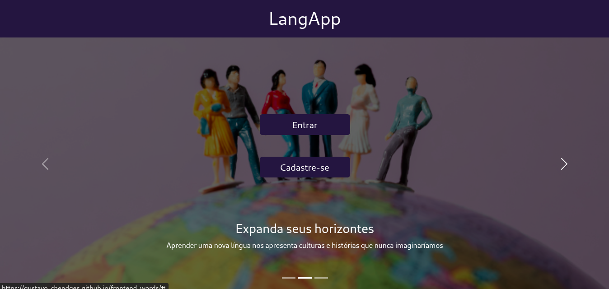
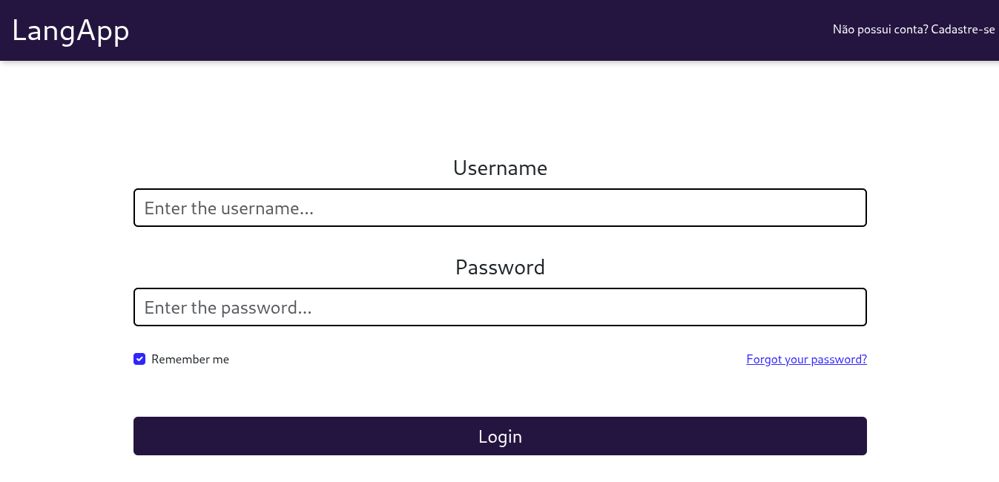
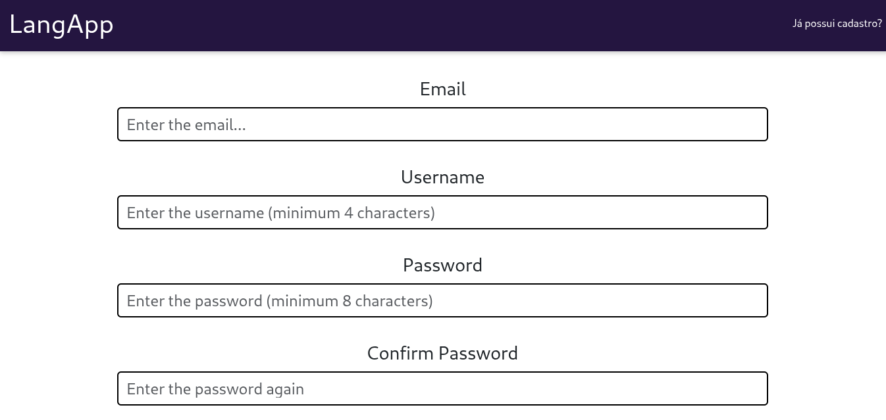
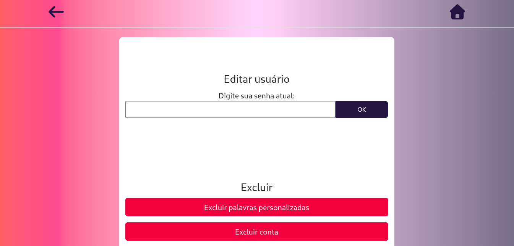
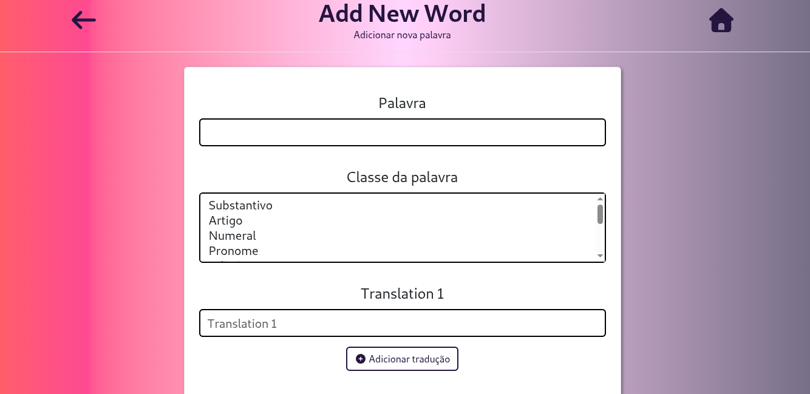
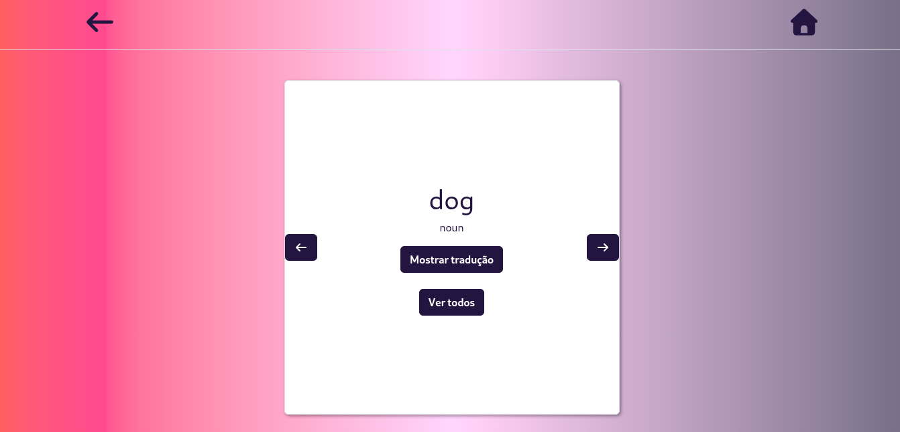

# Frontend LangApp:
- Link: https://gustavo-chendges.github.io/frontend-words/#/
- O app foi concebido como um caderno online de vocabulário para estudantes de idiomas (sendo inglês o foco inicial), combinando palavras básicas¹ pré-definidas com outras adicionadas pelo próprio usuário.
- Tecnicamente, trata-se de um sistema de CRUD que disponibliza algumas palavras da língua inglesa e permite ao usuário inserir as suas próprias. Conta com sistema de cadastro e login com nome de usuário, senha e email (que pode ser validado através de código enviado). A senha também pode ser recuperada através do email cadastrado e validado.
- O projeto também serve como base para futuras expansões acadêmicas.

## Descrição:
- Essa é a versão inicial do frontend do LangApp, um projeto acadêmico/educacional voltado à e prática do desenvolvimento em React e seu ecossistema. Durante seu desenvolvimento, foram consultados documentações oficiais, tutoriais e ferramentas de inteligência artificial. As implementações, no entanto, foram adaptadas as necessidades específicas do projeto.

## Preview:

### Landing Page:

### Tela de Login:

### Tela de cadastro:

### Configurações:

### Formulário de adição de palavras:

### Cartão de palavra:

  
## Arquitura e tecnologias utilizadas:
- React (com Javascript puro) para construção das páginas
- React Router para roteamento.
- React Bootstrap para formatação e estilização de componentes.
- Zod e React Hook Form para validação de formulários.
- Redux Toolkit para gerenciamento de estado global.
- RTK Query para conectar com os endpoints da API do backend, centralizando requisições e armazendo cache.

### Fluxo da aplicação
- Usuário -> React -> RTK Query -> Endpoints -> Banco de dados.

## Features
- Landing page pública básica.
- Telas de login, cadastro, recuperação de senha e validação de email.
- Mensagens de erro e de carregamento.
- Persistência de login através de tokens e <Outlet />
- Formulário de adição de palavras com campos dinâmicos.
- Possibilidade de filtrar as palavras nas listas tanto em português como em inglês.
- Exigência da senha para ações críticas (como alteração ou deleção da conta).

## Desafios enfrentados:
### Gerenciamento de estado:
- Para centralizar os estados compartilhados pelos componentes, foi usado Redux Toolkit. Essa decisão permitiu posteriormente a introdução de novas funcionalidades relacionadas ao mesmo domínio de forma relativamente fácil e escalável.
### Integração e persistência das informações de autenticação e validação de email:
- Funcionalidades como persistência de login e edição de informações da conta foram implementadas através de hooks personalizados, utilizando a token de acesso vindo do backend e jwt-decode.
### Formulários dinâmicos:
- Inicialmente, o campo de traduções (que é dinâmico e permite de um a três entradas) foi implementado usando lógica própria.
- Porém, ao assisitir um tutorial no YouTube (não relacionado diretamente ao projeto), eu descobri o React Hook Form, que facilitava imensamente o processo.

### Formulários compartilhados:
- O React Hook Form também se demonstrou útil ao ser usado para evitar o problema de duplicação de formulários (um para adição e outro para edição de palavras), abstraindo a lógica básica e permitindo apenas que as funções específicas de cada componenente fossem passadas como props.

## Melhorias planejadas:
- Opção de categorizar e visualizar palavras por área ("viagens", "comidas", "esportes"), ao invés de classe gramatical somente.
- Adição de aba introduzindo o usuário ao uso do Alfabeto Fonético Internacional. 
- Criação de aba de favoritos.
- Criação e integração com extensão para navegador que permita ao estudante a adção de novas palavras de forma mais prática.
- Recurso de exportação de listas de palavras personalizadas em formato .csv, compatível com plataformas amplamente utilizadas de flashcards, como Anki e Quizlet.

## Instalação
- git clone https://github.com/gustavo-chendges/frontend-words.git
- npm install
- Comentar ou remover a opção "base" do arquivo vite.config.js
- Editar a baseUrl do arquivo apiSlice.js de acordo com o endereço do backend.
- npm run dev

# Notas
- ¹A lista das "palavras básicas" referidas acima vem desse post, que ficou relativamente conhecido no meio de aprendizado de idiomas algum tempo atrás: https://www.reddit.com/r/languagelearning/comments/hy2hmt/625_words_to_learn_in_your_target_language
- Confira também o backend: https://github.com/gustavo-chendges/backend-words
